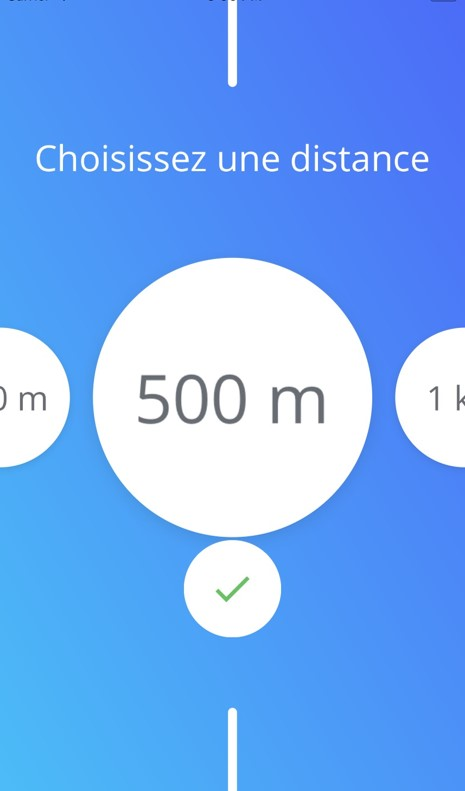
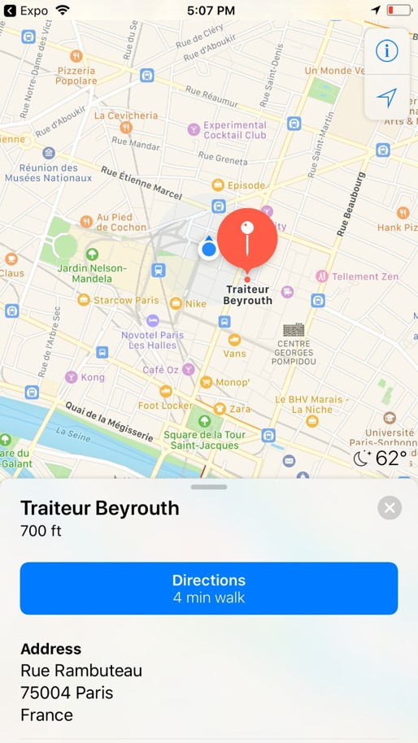
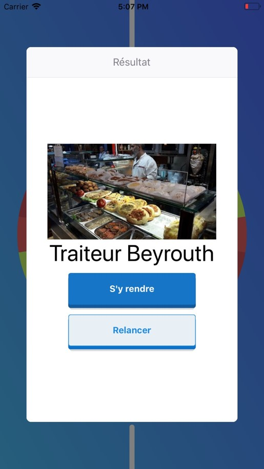

# SpinEat(React Native)

## Captures d'écran de l'application

## Installation des prérequis

### Installation de npm

La première étape est d'installer npm sur votre machine. Pour cela, vous devez télécharger et installer Node.js. Vous trouverez les liens de téléchargement à cette adresse. Pour les systèmes Debian et Ubuntu, vous pouvez également exécuter la commande suivante :

	sudo apt-get install nodejs npm

### Téléchargement du dépôt

Vous devez maintenant télécharger le corps de l'application. Pour cela, effectuez une copie de ce répertoire git avec la commande suivante :

	git clone https://git.charles-rio.ovh/Charles_RIO/SpinEat_mobile_app.git

Téléchargement des packages

Une fois npm installé et l'application téléchargée, il faut installer Expo : <https://docs.expo.io/versions/v29.0.0/introduction/installation>

Il suffit désormais d'ouvrir le dossier sur Expo. On peut également executer l'application directement sur un téléphone en utilisant la fonction "Share" d'Expo.

